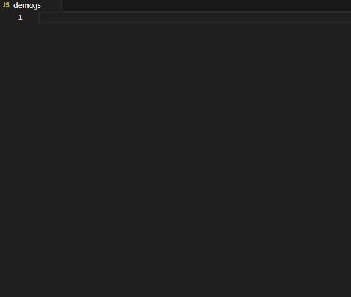

# Dot Anything

[](https://marketplace.visualstudio.com/items?itemName=lqzh.dot-anything) [](https://marketplace.visualstudio.com/items?itemName=lqzh.dot-anything) [](https://marketplace.visualstudio.com/items?itemName=lqzh.dot-anything) [](https://marketplace.visualstudio.com/items?itemName=lqzh.dot-anything) [](https://marketplace.visualstudio.com/items?itemName=lqzh.dot-anything)


[English](README.md)

## 亮点

> **⭐先想到什么，就先输入什么。**

```text
            ╭─────────────────────╮
            │ 💭 想输出变量 name？   │
            ╰──────────┬──────────╯
                       ○
                      ○
                  {\_/}
                  ( •.•)
                  / >

   😫 传统 Snippet                      😊 Dot Anything
      {\_/}                                {\_/}
      ( -_-)  name → clg → name            ( ^.^)  name.log
      / >     🔄 上下文切换 ×2              / >     ✨ 思维零打断
```


> **⭐不只是模板替换，而是可编程的代码片段。**

```text
            ╭──────────────────────────────╮
            │ 💭 代码片段加上函数会怎样？       │
            ╰──────────┬───────────────────╯
                       ○
                      ○
                  {\_/}
                  ( •.•)
                  / >

   📦 VS Code Snippets                   🚀 Dot Anything
      {\_/}                                {\_/}
      ( -_-)  key → 模板 → code            ( ^.^)  key → fn(env):模板 → code
      / >     📋 写死的                    / >     🧩 可编程 = ∞

```

按下 `.` 键，将文本转换为任意格式。不只是模板替换——支持 JavaScript 函数，实现可编程的代码片段。

## 目录

- [快速开始](#快速开始)
- [规则配置](#规则配置) — 属性一览、text 模式、function 模式
- [模板语法](#模板语法) — 环境变量、格式函数
- [进阶功能](#进阶功能) — 光标占位符、替换范围、正则匹配、文件类型过滤
- [自定义函数](#自定义函数)
- [调试与开发](#调试与开发)

## 快速开始



<table>
<tr><th>描述</th><th>配置</th><th>示例</th></tr>
<tr>
<td>插入 console.log（含文件位置）</td>
<td><pre lang="json">{
    "dot-anything.rules": [
        {
            "trigger": "log",
            "description": "插入 console.log（含文件位置）",
            "snippet": "console.log('🖨️ #filePath#[#lineNumber#:#column#] #word^toKebabCase#:', #word#);"
        }
    ]
}</pre></td>
<td><code>HelloWorld.log</code> →<pre lang="js">console.log('🖨️ /home/demo.js[15:12] hello-world:', HelloWorld);</pre></td>
</tr>
</table>

**[→ 更多常用配置](./doc/rules/cn.md)**

## 规则配置

在 VS Code 设置中配置 `dot-anything.rules`，每条规则的属性如下：

| 属性          | 类型                       | 必填 | 默认值   | 说明                              |
| ------------- | -------------------------- | ---- | -------- | --------------------------------- |
| `trigger`     | string                     | 是   | -        | 触发关键词                        |
| `description` | string                     | 否   | -        | 描述（支持 Markdown）             |
| `snippet`     | string \| string[]         | 是   | -        | 模板字符串或函数（支持数组多行）  |
| `type`        | `text` \| `function`       | 否   | `text`   | 规则类型                          |
| `fileType`    | string[]                   | 否   | `["*"]`  | 语言标识符（如 `["javascript"]`） |
| `replaceMode` | `word` \| `line` \| `file` | 否   | `word`   | 替换范围（单词 / 整行 / 整文件）  |
| `pattern`     | string                     | 否   | `(\S+)$` | 自定义触发正则（末尾 `.` 已去除） |

### text 模式（默认）

使用 `#变量^格式函数#` 占位符语法：

<table>
<tr><th>描述</th><th>配置</th><th>示例</th></tr>
<tr>
<td>插入 console.log</td>
<td><pre lang="json">{
    "trigger": "log",
    "description": "插入 console.log",
    "fileType": ["javascript", "typescript"],
    "snippet": "console.log('#word^toUpperCase#', #word#)"
}</pre></td>
<td><code>abc.log</code> → <code>console.log('ABC', abc)</code></td>
</tr>
</table>

### function 模式

使用 JavaScript 箭头函数进行复杂转换：

| 参数  | 说明                                          |
| ----- | --------------------------------------------- |
| `env` | 环境变量对象（`env.word`、`env.fileName` 等） |
| `fns` | 格式化工具（`fns.toCamelCase` 等）            |

<table>
<tr><th>描述</th><th>配置</th><th>示例</th></tr>
<tr>
<td>插入带文件信息的 console.log</td>
<td><pre lang="json">{
    "trigger": "log",
    "description": "插入带文件信息的 console.log",
    "type": "function",
    "snippet": "(env, { fns }) => `console.log('[${env.fileName}:${env.lineNumber}] ${fns.toUpperCase(env.word)}:', ${env.word})`"
}</pre></td>
<td><code>abc.log</code> →<pre lang="js">console.log('[demo:23] ABC:', abc)</pre></td>
</tr>
<tr>
<td>生成 getter/setter 方法<br>（数组多行写法）</td>
<td><pre lang="json">{
    "trigger": "getter",
    "description": "生成 getter/setter 方法",
    "type": "function",
    "snippet": [
        "(env, { fns }) => `\\",
        "{",
        "    _${env.word}: 1,",
        "    get ${fns.toPascalCase(env.word)}() {",
        "        return this._${env.word};",
        "    },",
        "    set ${fns.toPascalCase(env.word)}(v) {",
        "        this._${env.word} = v;",
        "    }",
        "}`"
    ]
}</pre></td>
<td><code>abc.getter</code> →<pre lang="js">{
    _abc: 1,
    get Abc() {
        return this._abc;
    },
    set Abc(v) {
        this._abc = v;
    }
}</pre></td>
</tr>
</table>

## 模板语法

### 环境变量

text 模式中通过 `#变量名#` 引用，function 模式中通过 `env.变量名` 访问。

| 变量              | 说明               |
| ----------------- | ------------------ |
| `word`            | 输入文本（`.` 前） |
| `match`           | 正则匹配捕获组数组 |
| `filePath`        | 文件完整路径       |
| `fileName`        | 文件名（无扩展名） |
| `fileBase`        | 文件名（含扩展名） |
| `fileExt`         | 文件扩展名         |
| `fileDir`         | 文件所在目录       |
| `languageId`      | 语言标识符         |
| `lineNumber`      | 当前行号           |
| `column`          | 当前列号           |
| `lineText`        | 当前行文本         |
| `workspaceFolder` | 工作区路径         |

### (内置)格式函数

text 模式中通过 `^函数名` 后缀使用（如 `#word^toUpperCase#`），function 模式中通过 `fns.函数名()` 调用。

| 函数               | 说明                           | 示例                           |
| ------------------ | ------------------------------ | ------------------------------ |
| *(无后缀)*         | 保持原样                       | `helloWorld` → `helloWorld`    |
| `toLowerCase`      | 全部小写                       | `HELLO` → `hello`             |
| `toUpperCase`      | 全部大写                       | `hello` → `HELLO`             |
| `toUpperCaseFirst` | 仅首字母大写，其余不变         | `hello world` → `Hello world` |
| `toCapitalize`     | 首字母大写，其余小写           | `hello World` → `Hello world` |
| `toTitleCase`      | 每个单词首字母大写             | `hello world` → `Hello World` |
| `toKebabCase`      | 短横线连接，全小写             | `HelloWorld` → `hello-world`  |
| `toSnakeCase`      | 下划线连接，全小写             | `HelloWorld` → `hello_world`  |
| `toCamelCase`      | 小驼峰                         | `hello-world` → `helloWorld`  |
| `toPascalCase`     | 大驼峰                         | `hello-world` → `HelloWorld`  |

## 进阶功能

### 光标占位符（Tab 跳转）

在 snippet 中使用 `#✏️#` 语法定义可编辑位置，支持 Tab 跳转和自动格式转换。

**语法：** `#✏️<索引>^<修饰符>-<注释>#`

| 部分       | 必填 | 说明                       |
| ---------- | ---- | -------------------------- |
| `<索引>`   | 是   | Tab 跳转顺序（从 1 开始） |
| `<修饰符>` | 否   | 离开时应用的格式函数       |
| `<注释>`   | 否   | 占位符默认值/提示文本      |

<table>
<tr><th>描述</th><th>配置</th><th>示例</th></tr>
<tr>
<td>生成 const 声明</td>
<td><pre lang="json">{
    "trigger": "const",
    "description": "生成 const 声明",
    "snippet": "const #✏️1^toUpperCase-name# = #✏️2-value#;"
}</pre></td>
<td>输入 <code>myVar.const</code><br>→ 插入 <code>const name = value;</code><br>→ 编辑 name 为 <code>myvar</code><br>→ 按 Tab → 自动转为 <code>MYVAR</code></td>
</tr>
<tr>
<td>搭配自定义函数<br>展示多种命名风格</td>
<td><pre lang="json">{
    "dot-anything.rules": [
        {
            "trigger": "cases",
            "description": "展示多种命名风格",
            "snippet": "camel: #✏️1^toCamelCase#, hook: #✏️1^reactHook#"
        }
    ],
    "dot-anything.fns": [
        {
            "name": "reactHook",
            "fn": "(s = '', { fns }) => `use${fns.toUpperCaseFirst(s)}`"
        }
    ]
}</pre></td>
<td>输入 <code>demo.cases</code><br>→ 编辑为 <code>hello world</code><br>→ 按 Tab →<pre>camel: helloWorld
hook: useHello world</pre></td>
</tr>
</table>

> **注意：** 相同索引的占位符共享同一个默认值（VS Code 原生限制），但各位置可有不同的修饰符，离开时分别应用不同转换。

### 替换范围（replaceMode）

控制补全时替换的文本范围：

| 值     | 替换范围     | 示例（输入 `abc def.`，结果为 `DEF`） |
| ------ | ------------ | ------------------------------------- |
| `word` | 仅最近的单词 | `abc DEF`                             |
| `line` | 当前整行     | `DEF`                                 |
| `file` | 整个文件     | 整个文件内容被替换                    |

<table>
<tr><th>描述</th><th>配置</th><th>示例</th></tr>
<tr>
<td>将整行转为注释</td>
<td><pre lang="json">{
    "trigger": "//",
    "description": "将整行转为注释",
    "pattern": "",
    "replaceMode": "line",
    "snippet": "// #lineText#"
}</pre></td>
<td>行 <code>abc def</code> →<pre lang="js">// abc def</pre></td>
</tr>
</table>

> 格式化结果不受 `replaceMode` 影响，仅替换范围不同。默认值 `word` 与旧版完全兼容。

### 正则匹配（pattern）

默认匹配 `.` 前的非空文本（`(\S+)$`），可通过 `pattern` 自定义触发正则。

**空 pattern — 无需输入即触发：** 设置 `"pattern": ""` 后只需输入 `.` 即可触发。

<table>
<tr><th>描述</th><th>配置</th><th>示例</th></tr>
<tr>
<td>数字转 px<br>（仅匹配数字）</td>
<td><pre lang="json">{
    "trigger": "px",
    "description": "数字转 px",
    "pattern": "(\\d+)$",
    "snippet": "#word#px"
}</pre></td>
<td><code>16.px</code> → <code>16px</code><br>（非数字不会触发）</td>
</tr>
<tr>
<td>交换两个单词<br>（捕获组）</td>
<td><pre lang="json">{
    "trigger": "swap",
    "description": "交换两个单词",
    "pattern": "(\\w+)\\s+(\\w+)$",
    "snippet": "#match.2# #match.1#"
}</pre></td>
<td><code>hello world.swap</code> → <code>world hello</code></td>
</tr>
</table>

**通过 `match` 访问捕获组：**

| 语法               | 说明                | 示例（pattern `(hello) (world)`） |
| ------------------ | ------------------- | --------------------------------- |
| `#match#`          | 所有匹配组逗号拼接  | `hello world,hello,world`         |
| `#match.N#`        | 第 N 个捕获组       | `#match.1#` → `hello`            |
| `#match.N^format#` | 捕获组 + 格式函数   | `#match.1^toUpperCase#` → `HELLO` |
| `env.match[N]`     | function 模式中访问 | `env.match[2]` → `world`         |

### 文件类型过滤（fileType）

限制规则只在特定语言生效：

<table>
<tr><th>描述</th><th>配置</th><th>示例</th></tr>
<tr>
<td>插入 print（仅 Python）</td>
<td><pre lang="json">{
    "trigger": "print",
    "description": "插入 print",
    "fileType": ["python"],
    "snippet": "print('#word#', #word#)"
}</pre></td>
<td><code>data.print</code> → <code>print('data', data)</code></td>
</tr>
</table>

常用标识符：`*`（所有）、`javascript`、`typescript`、`python`、`java`、`go`、`rust`、`html`、`css`、`json`、`markdown` — [完整列表](https://code.visualstudio.com/docs/languages/identifiers#_known-language-identifiers)

## 自定义函数

通过 `dot-anything.fns` 配置自定义格式化函数，可在 text 和 function 模式中使用：

```json
{
    "dot-anything.fns": [
        {
            "name": "prefix",
            "fn": "(s) => 'prefix_' + s"
        },
        {
            "name": "wrap",
            "fn": "(s, { fns }) => `{{${fns.toUpperCase(s)}}}`"
        }
    ]
}
```

<table>
<tr><th>描述</th><th>配置</th><th>示例</th></tr>
<tr>
<td>text 模式 — 添加前缀</td>
<td><pre lang="json">{
    "trigger": "prefix",
    "description": "添加前缀",
    "snippet": "#word^prefix#"
}</pre></td>
<td><code>hello.prefix</code> → <code>prefix_hello</code></td>
</tr>
<tr>
<td>function 模式 — 生成 React Hook 名称</td>
<td><pre lang="json">{
    "dot-anything.rules": [
        {
            "trigger": "hook",
            "type": "function",
            "description": "生成 React Hook 名称",
            "snippet": "(env, o) => o.fns.reactHook(env.word, o)"
        }
    ],
    "dot-anything.fns": [
        {
            "name": "reactHook",
            "fn": "(s, { fns }) => `use${fns.toUpperCaseFirst(s)}`"
        }
    ]
}</pre></td>
<td><code>state.hook</code> → <code>useState</code></td>
</tr>
</table>

| 参数  | 说明                                   |
| ----- | -------------------------------------- |
| `s`   | 输入字符串                             |
| `fns` | 内置格式化函数（如 `fns.toUpperCase`） |

> **注意：** function 模式中调用自定义函数时需透传第二个参数 `o`（含 `fns`），否则内部无法访问内置函数。自定义函数会覆盖同名内置函数。

## 调试与开发

**调试模式：**

```json
{ "dot-anything.debug": true }
```

**开发环境：** Node.js 22.x、VS Code 1.103.0+

```bash
npm run compile    # 开发构建
npm run watch      # 监听模式
npm run package    # 生产构建
npm test           # 运行测试
```

按 `F5` 启动扩展开发宿主进行调试。

## 许可证

查看 [LICENSE.txt](LICENSE.txt)。

## 反馈与贡献

- 问题反馈：[GitHub Issues](https://github.com/lqzhgood/vscode-ext-dot-anything/issues)
- 赞助支持：[GitHub Sponsors](https://github.com/sponsors/lqzhgood)

<hr />


